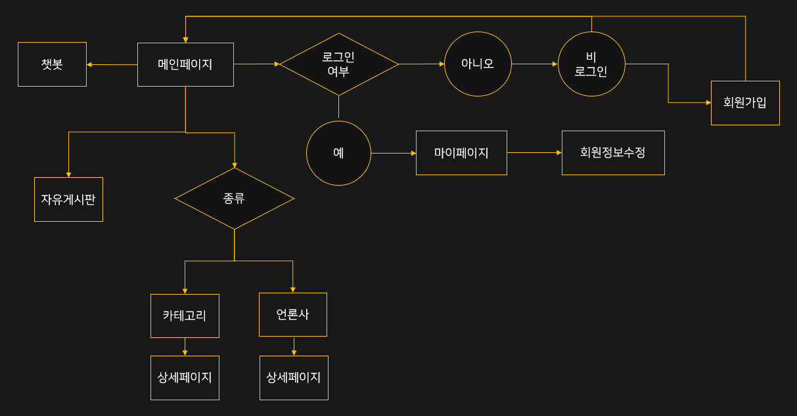

# Project : OCN (Overseas Catch News)

#### ◽ 프로젝트 기간

​	2021.10.28 ~ 2021.12.02 (5주)

#### ◽ 프로젝트 소개

​	AI기술을 활용한 해외 뉴스 기사 제공 플랫폼

​	구체적으로 해외기사를 언론사별, 카테고리별로 모아서 한번에 볼 수 있는 플랫폼이다. 더불어 시각적 불편함을 가진 사람들과, 기사를 읽을 시간이 없어 듣고 싶어하는 사람들에게 TTS 기능을 통한 읽기 서비스를 제공한다.

​	국내에 몇몇 신문기사들을 모아서 보여주는 사이트들과의 차별점은 국내언론사의 기사들을 모아서 보여주는 사이트들과 다르게 해외기사를 모아서 보여주고, 챗봇과 TTS 기능을 넣어서 차별화를 했다. 

#### ◽ 주요기능

​	로그인, 회원가입, 개인정보 수정, 크롤링, 기사 보기, 게시판, 댓글 및 대댓글, TTS(Text To Speech), 챗봇

#### ◽ 개발환경 및 언어

​	\- Window 10 Home 64bit

​	\- SpringToolSuite4 - 4.12.0.RELEASE

​	\- Eclipse IDE version - 2020-12 (4.18.0)

​	\- Apache Tomcat 9.5.3

​	\- Java

​	\- JavaScript

​	\- MySQL

​	\- HTML

​	\- CSS

#### ◽ 팀 구성 및 역할분담

​	\- **김경훈(팀장)** - 프로젝트 통합 / 로그인 / 회원가입 / 마이페이지 / 개인정보 수정 / 기사 리스트(CSS) / 

​								자유게시판 리스트(CSS) / 마이페이지(CSS)

​	\- **엄민호** - 자유게시판 / 댓글 / CNN기사 리스트 / 인기글 / 자유게시판 상세페이지(CSS) / 안내창(CSS)

​	\- **이제윤** - 크롤링 / 카테고리별 기사 리스트 / 기사 상세 페이지(TTS, 댓글) / 전체 기사 검색 페이지

​	\- **천웅재** - 챗봇 / 회원가입(CSS) / 로그인(CSS) / 개인정보 수정(CSS) /챗봇(CSS)

​	\- **한예슬** - 크롤링 / BBC 기사 리스트 / 기사 상세 페이지 / 메인페이지(CSS) / 기사 상세페이지(CSS)

#### ◽ 순서도

#### ◽ 프로젝트 소감 

​	처음으로 웹 개발 코딩 프로젝트에서 팀장을 해봤다. 지금까지 내 전공에서 했던 프로젝트와 다르게 팀장의 역할이 중요했다. 프로젝트 진행과정을 더 세부적으로 관리하고, 팀원들을 독려하고, 소통할 필요성이 많았고, 중간중간 merge하는 부분, 그 과정에서 발생하는 에러를 해결하는 부분에서도 신경쓸 것이 많았다. 

​	프로젝트 계획을 짜는 과정에서는 여러 번 의견이 나뉘고, 계획안이 번복되면서 난항을 겪었는데, 한번 계획을 짜고나서는 팀원들과 원활하게 소통하며 프로젝트를 진행할 수 있었다. 코딩할 때 힘든 부분에서는 팀원들에게 도움을 구하기도 하고, 내 역량 안의 일들은 도움을 주기도 했다. 팀원들 중 그 어느 누구도 본인의 고집을 내세우지 않아서 의견을 잘 모으면서 프로젝트 진행할 수 있었고, 팀장으로서 팀원들에게 정말 고맙다. 

​	이번 프로젝트를 통해 스프링 부트를 이용한 Restful 방식의 프로그래밍에 대해 충분히 이해하며 익힐 수 있었고, Ajax를 통해 페이지 갱신없이 서버와 비동기 통신하는 개념도 실제로 적용해보며 익힐 수 있었다. 우리 조는 Ajax를 쓰면서 tiles형태로 프론트를 구현했는데, 이 과정에서 tiles를 쓰는 것의 불편함과, 이 불편함을 해소하는 과정에서 session에 대해 배울 수 있었다. 또한 직접 크롤링을 하진 않았지만, 계획 단계에서 관련 영상을 많이 찾아보고, 어떤 식으로 운용되는지 코딩을 보고 이해함으로써 데이터 수집과 Html에 대한 이해도를 키울 수 있었다. 이외에도 Spring Boot, Java, MySQL 등을 직접 해보면서 배울 수 있었던 것들이 많아 개발자로서 성장할 수 있었던 좋은 경험이었다.

​	내가 팀장을 맡고 프로젝트를 시작할 때, 팀원들에게 코딩에서는 부족한 점이 많지만, 서로 소통이 잘 되고 프로젝트를 잘 마칠 수 있도록 노력하겠다고 말했다. 프로젝트를 모두 마친 지금, 내가 한 말이 나름대로 모두 지켜져서 정말 다행이고 기쁘다. 이것들 모두가 팀장을 믿고 잘 따라주며, 각자 맡은 바 최선을 다해준 팀원들 덕분이고, 고맙다고 말하고 싶다.